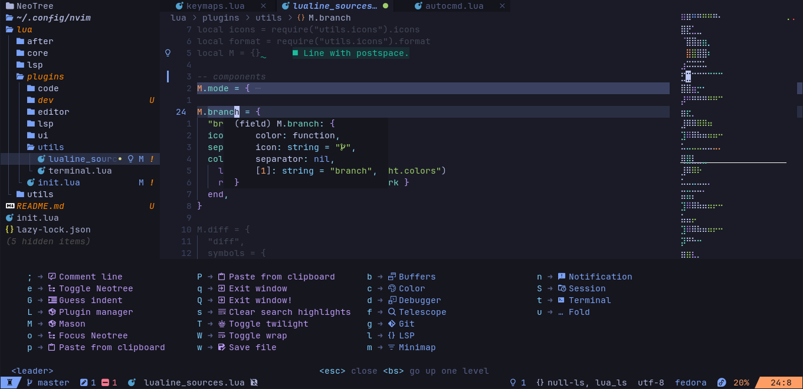

# nvimrc

**NOTE:** Neovim [nightly](https://github.com/neovim/neovim/releases/nightly) is required for inlay hint

This repository contains my personal Neovim configuration, designed to be comprehensive and to provide a feature-rich IDE experience with a polished UI.

